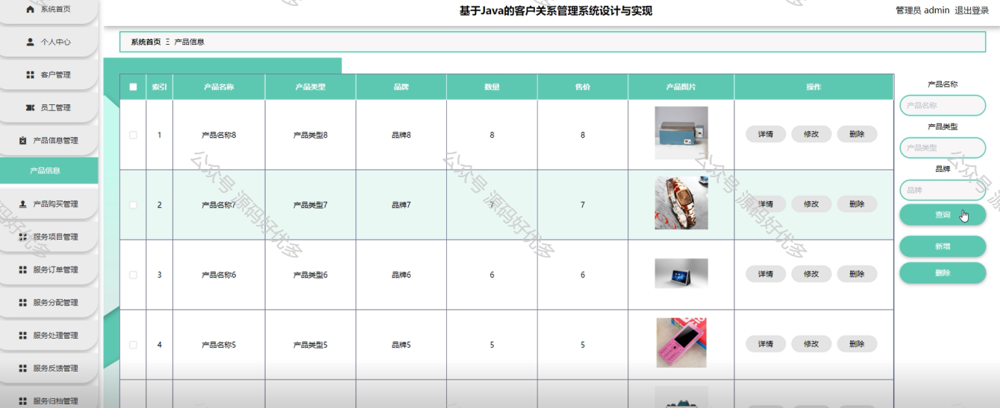

 
## 查看主页获取源码

### 一、作品包含

源码+数据库+设计文档万字+PPT+全套环境和工具资源+部署教程

### 二、项目技术

前端技术：Html、Css、Js、Vue、Element-ui

数据库：MySQL

后端技术：Java、Spring Boot、MyBatis

  

### 三、运行环境

开发工具：IDEA/eclipse

数据库：MySQL5.7

数据库管理工具：Navicat10以上版本

环境配置软件： JDK1.8+Maven3.6.3

前端Nodejs：14

### 四、项目介绍
项目编号：springbootA268

客户关系管理系统（CRM）在现代商业环境中扮演着核心角色，它起源于企业对客户信息管理的需求，随着市场竞争的加剧和客户期望的提高，CRM逐渐发展成为一个综合性的商业策略，旨在通过优化客户互动和提升客户体验来巩固企业的市场地位，同时促进企业与客户之间长期信任关系的建立。

前台用户功能：浏览首页、热门景点、酒店信息、推荐线路、旅游攻略、景点资讯、后台管理、个人中心。

后台分为管理员、员工、客户
管理员的功能：系统首页、个人中心、客户管理、员工管理、产品信息管理、产品购买管理、服务项目管理、服务订单管理、服务分配管理、服务处理管理、服务反馈管理、服务归档管理、客户分析管理、系统管理。
员工的功能：系统首页、个人中心、服务分配管理、服务处理管理、服务反馈管理、服务归档管理。
客户的功能：系统首页、个人中心、产品信息管理、产品购买管理、服务订单管理、服务处理管理和服务反馈管理。

### 五、运行截图

  

